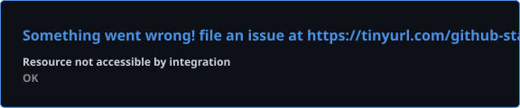
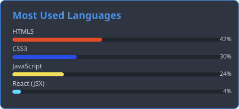

<div align="center">


<a href="https://github.com/alishbajaved45">
  
</a>

<br/>


<br/>


</div>

<br/>

## 🧑‍💻 Who I Am

```typescript
const alishbaJaved = {
  title: "Full-Stack Web Developer (MERN)",
  stack: {
    frontend: ["HTML5", "CSS3", "Tailwind CSS", "JavaScript (ES6+)", "React.js", "Vite", "Responsive Web Design"],
    backend: ["Node.js", "Express.js"],
    database: ["MongoDB", "MySQL"],
    generativeAI: ["OpenAI API", "Gemini", "LangChain"],
  },
  launchedProjects: ["savory-bites-restaurant-website", "portfolio-landing-page"],
  certifications: [],
  status: "Learning the MERN Stack, Building Full-Stack Web Development Projects",
  openTo: ["Full-Stack Developer Roles", "Freelance Projects", "Collaboration"],
};
```

<br/>

## 🚀 Featured Projects

### 🍽️ Savory Bites — Restaurant Website

A fully responsive restaurant website built with HTML, Tailwind CSS, and JavaScript, featuring an interactive menu, table reservations, and a modern user experience.

| Layer | Technology |
|---|---|
| Structure | HTML5 |
| Styling | Tailwind CSS |
| Interactivity | JavaScript |

🔗 [Code](https://github.com/alishbajaved45/savory-bites-restaurant-website)

<br/>

### 🎨 Portfolio Landing Page

A responsive portfolio landing page built with HTML and CSS, focusing on modern styling and layout design.

| Layer | Technology |
|---|---|
| Structure | HTML5 |
| Styling | CSS3 |

🔗 [Code](https://github.com/alishbajaved45/portfolio-landing-page)

<br/>

## 🛠️ Tech Stack

**Frontend**


**Backend**


**Database**


**Generative AI**


<br/>


## 📊 GitHub Stats

<div align="center">



<br/>



<br/>


</div>
<br/>

### 📈 Contribution Activity

<div align="center">


</div>

<br/>

## 🔗 Connect With Me

<div align="center">

[](https://github.com/alishbajaved45/)
[](https://www.linkedin.com/in/alishbaa-javed/)
[](mailto:work.alishba45@gmail.com)
[](https://alishba-javed.vercel.app/)

</div>


