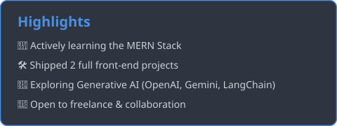

<div align="center">


<a href="https://github.com/alishbajaved45">
  
</a>

<br/>


<br/>


</div>

<br/>

## 📑 Table of Contents

- [About Me](#-about-me)
- [Who I Am](#-who-i-am)
- [Featured Projects](#-featured-projects)
- [Tech Stack](#️-tech-stack)
- [GitHub Stats](#-github-stats)
- [Acknowledgements](#-acknowledgements)
- [Feedback & Collaboration](#-feedback--collaboration)
- [Connect With Me](#-connect-with-me)

<br/>

## 👋 About Me

I'm **Alishba Javed**, a Full-Stack Web Developer specializing in the **MERN Stack**. I build responsive, user-focused web applications from interactive front-ends with React and Tailwind CSS to robust back-ends powered by Node.js, Express, and MongoDB. I'm also expanding into **Generative AI**, working with tools like the OpenAI API, Gemini, and LangChain to build smarter, more capable applications.
I'm currently deepening my MERN stack skills through hands-on projects, and I'm open to full-stack developer roles, freelance work, and collaborative opportunities.

<br/>

## 🧑‍💻 Who I Am

```typescript
const alishbaJaved = {
  title: "Full-Stack Web Developer (MERN)",
  stack: {
    frontend: ["HTML5", "CSS3", "Tailwind CSS", "JavaScript (ES6+)", "React.js", "Vite", "Responsive Web Design"],
    backend: ["Node.js", "Express.js"],
    database: ["MongoDB", "MySQL"],
    generativeAI: ["OpenAI API", "Gemini", "LangChain"],
  },
  launchedProjects: ["savory-bites-restaurant-website", "portfolio-landing-page"],
  certifications: [],
  status: "Learning the MERN Stack, Building Full-Stack Web Development Projects",
  openTo: ["Full-Stack Developer Roles", "Freelance Projects", "Collaboration"],
};
```

<br/>

## 🚀 Featured Projects

### 🍽️ Savory Bites — Restaurant Website

A fully responsive restaurant website built with HTML, Tailwind CSS, and JavaScript, featuring an interactive menu, table reservations, and a modern user experience.

| Layer | Technology |
|---|---|
| Structure | HTML5 |
| Styling | Tailwind CSS |
| Interactivity | JavaScript |

🔗 [Live](https://alishbajaved45.github.io/savory-bites-restaurant-website/) &nbsp;|&nbsp; [Code](https://github.com/alishbajaved45/savory-bites-restaurant-website)

<br/>

### 🎨 Portfolio Landing Page

A responsive portfolio landing page built with HTML and CSS, focusing on modern styling and layout design.

| Layer | Technology |
|---|---|
| Structure | HTML5 |
| Styling | CSS3 |

🔗 [Live](https://alishbajaved45.github.io/portfolio-landing-page/) &nbsp;|&nbsp; [Code](https://github.com/alishbajaved45/portfolio-landing-page)
<br/>

## 🛠️ Tech Stack

**Frontend**


**Backend**


**Database**


**Generative AI**


## 📊 GitHub Stats


<br/>


<br/>

### ✨ Highlights



### 📈 Contribution Activity

<div align="center">


</div>

<br/>

## 🙌 Acknowledgements

This profile README uses these open-source tools to power the dynamic cards above — big thanks to their maintainers:
- [Capsule Render](https://github.com/kyechan99/capsule-render) — waving header/footer banners
- [Readme Typing SVG](https://github.com/DenverCoder1/readme-typing-svg) — animated typing text
- [GitHub Stats Extended](https://github.com/stats-organization/github-stats-extended) — stats and pin cards
- [GitHub Readme Streak Stats](https://github.com/DenverCoder1/github-readme-streak-stats) — streak card
- [GitHub Profile Trophy](https://github.com/ryo-ma/github-profile-trophy) — trophy showcase
- [GitHub Readme Activity Graph](https://github.com/Ashutosh00710/github-readme-activity-graph) — contribution graph
- [Skill Icons](https://github.com/tandpfun/skill-icons) — tech stack icons

## 🤝 Feedback & Collaboration

Open to feedback, collaboration on Full-Stack or MERN projects, and freelance opportunities. Feel free to reach out through any of the links above. I'd love to connect!

## 🔗 Connect With Me

<div align="center">

[](https://github.com/alishbajaved45/)
[](https://www.linkedin.com/in/alishbaa-javed/)
[](https://alishba-javed.vercel.app/)

</div>


